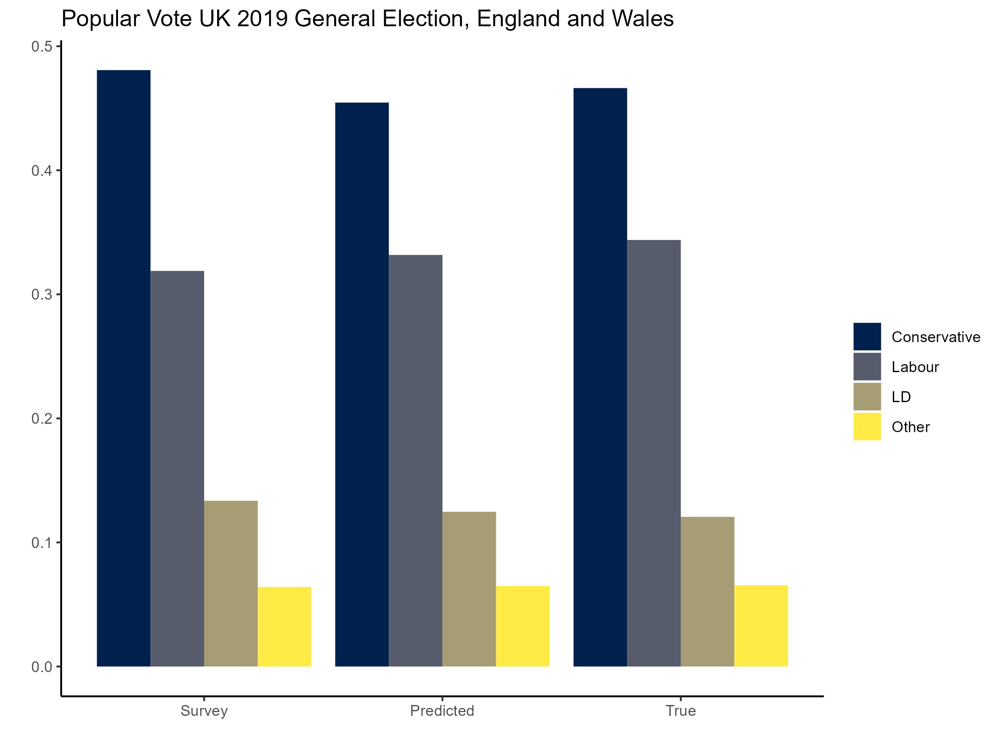
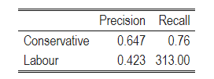

# Data Scientist Exercise

## Description
I was tasked with estimating UK 2019 General Election results for England and Wales using a simple Multilevel Regression and Poststratification (MRP) model.

### Data
For my poststratification I used population counts for interlocked demographic groups, downloaded from the ONS's "Create  a custom dataset" page. The demographic characteristics included were age (12 categories), highest level of qualification (8 categories) and sex.

To develop a set of models to estimate differential turnout rates and the percentage of people voting for the Conservatives, Labor, Liberal Democrats, or Other parties, I used cross-sectional data from the 2019 BES Post-Election Random Probability Survey.

Finally, the true election results were extracted from the 2010-2019 BES Constituency Results with Census and Candidate Data.

### Model
I used a logistic regression model to estimate 5 outcomes (Turnout, Conservative, Labour, Liberal Democrat, and Other). The variables included in this model were female (a dummy for whether the individual is as male or female), region (included because the survey data did not contain estimates for all constituencies) constituency, age bracket (with 10 age levels), and educational level (with 8 levels). Addtionally, I used random intercepts for all factor predictors to account for variation between groups given the heirarchical nature of my dataset. 

## Results
The model did a better job than the survey in predicting the popular vote for the 2019 General Election. The model predicted a 45.5% vote share for Conservatives (true vote share was 46.6%), 33.1% for Labour (compared to the true result of 34.3%), 12.5% for Liberal Democrats (compared to the true result of 12.1%), and 6.5% for Other parties (true result was 6.5% as well). A comparison of the survey, predicted and true results are shown in the graph below:

Furthermore, the model predicted the correct winner in 336 constituencies out of 573 (58%) in England and Wales. This is not great but it is better than random chance. In addition to this, precision for Conservative wins was 64.7%. Precision and recall metrics for Conservatives and Labour are shown below:

  

                                                                                 
